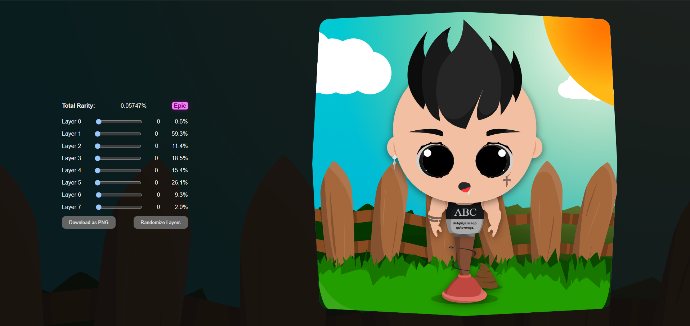
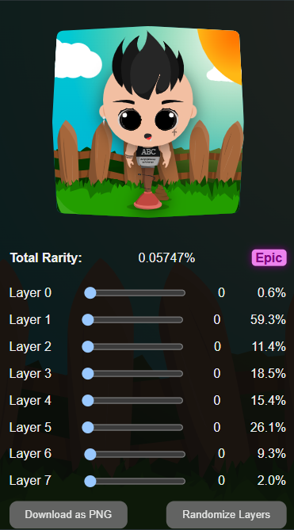

# 🌟 StandBoy NFT Generator  
[👉 Visit the Website](https://stand-boys.vercel.app/)

---

## 🎨 Overview  
**StandBoy** is a web-based platform that allows users to generate unique StandBoy NFTs directly in the browser. Inspired by stylized, character-based NFT collections, the site offers a fun and simple way to create and download your own custom StandBoy characters.

---

## ⚙️ Features  
- 🧑‍🎨 Randomized StandBoy character generation  
- 🖼️ Unique NFT-style visuals with each refresh  
- 💾 Option to download your StandBoy as an image  
- 🪄 Optimized for fast performance and simple UX  
- 🌐 Fully deployed and accessible via Vercel  

---

## 🚀 Technologies Used  
- **Next.js** – React framework for SSR and SSG  
- **TypeScript** – Type-safe frontend/backend logic  
- **Tailwind CSS** – Modern utility-first CSS styling  
- **Vercel** – Fast CI/CD and hosting solution  

---

## 🖼️ Screenshots  

### 💻 On Desktop  


### 📱 On Mobile  


> Make sure `screenshot1.png` and `screenshot2.png` exist in the `/public` directory before pushing to GitHub.

---

## 📦 Getting Started (Local Development)  

```bash
# Clone the repository
git clone https://github.com/your-username/standboy-nft.git
cd standboy-nft

# Install dependencies
npm install

# Run the development server
npm run dev
```

Then open [http://localhost:3000](http://localhost:3000) in your browser.

---

## 🧠 Inspiration  
This project was inspired by generative art NFT collections, aiming to bring creativity and joy to users through randomized character art—no blockchain required.

---

## 📜 License  
This project is licensed under the **MIT License**.

---

## 🙌 Contributing  
Have ideas or want to expand the project into a full NFT minting platform?  
Fork the repo, make your changes, and submit a pull request!
